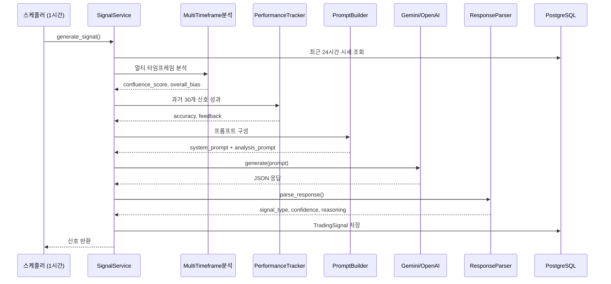
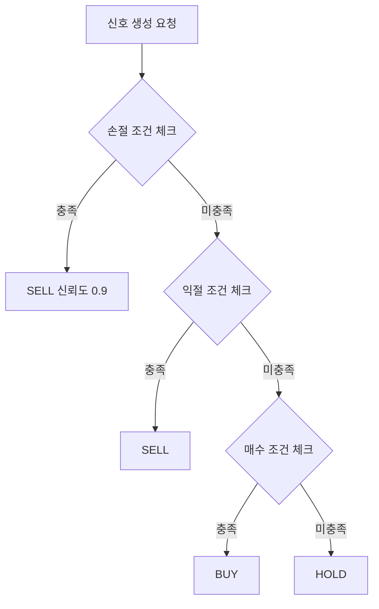

# AI 신호 생성 시스템 분석

> 작성일: 2026-01-24
> 대상: Bitcoin-Auto-Trading Backend

---

## 1. 시스템 개요

### 1.1 핵심 구성요소

```
signal/
├── service.py              # 신호 생성 메인 로직
├── prompt/
│   ├── templates.py        # 코인별 시스템 프롬프트
│   ├── builder.py          # 분석 프롬프트 구성
│   └── indicator_status.py # 지표 상태 한글화
├── parser/
│   └── response_parser.py  # AI 응답 JSON 파싱
├── tracker/
│   └── performance_tracker.py  # 성과 피드백
└── classifier/
    └── coin_classifier.py  # 코인 유형 분류
```

### 1.2 신호 생성 흐름



---

## 2. 코인 유형별 프롬프트

### 2.1 코인 분류

| 유형 | 대상 | 특징 |
|------|------|------|
| **메이저** | BTC, ETH, SOL, XRP | 낮은 변동성, 기술적 지표 중시 |
| **밈코인** | DOGE, SHIB, PEPE | 높은 변동성, 거래량/모멘텀 중시 |
| **알트코인** | 기타 | 중간 변동성, 균형 전략 |

### 2.2 손익 설정 비교

| 설정 | 메이저 | 밈코인 | 알트코인 |
|------|:------:|:------:|:--------:|
| 손절 | 1.5% | 3.0% | 2.0% |
| 익절 | 2.5% | 5.0% | 3.5% |
| 트레일링 | 2.0% | 3.5% | 2.5% |
| 본전손절 | 1.0% | 2.0% | 1.5% |
| RSI 과매수 | 70 | 80 | 75 |
| RSI 과매도 | 30 | 25 | 28 |
| 최소 신뢰도 | 0.60 | 0.55 | 0.60 |
| 최소 합류점수 | 0.45 | 0.50 | 0.55 |

---

## 3. 프롬프트 구조

### 3.1 시스템 프롬프트 (코인 유형별)

```
당신은 {currency} 트레이딩 전문가 AI입니다.

## 최우선 원칙: 리스크 관리 (Risk First)

### 손절 강제 규칙 (MANDATORY)
다음 조건 중 하나라도 충족 → 무조건 SELL (신뢰도 0.9):
1. 현재가 <= 평균매수가 × (1 - 손절비율)
2. 미실현 손실 >= 손절비율
3. 현재가 < 이전 손절가

### 포지션 상태별 의사결정
[포지션 없음]
├─ Confluence >= 0.45 AND RSI < 65 AND 2개+ TF 상승 → BUY
├─ [과매도 반등] RSI <= 35 AND BB% <= 25% → BUY
└─ 그 외 → HOLD

[보유 중 - 수익]
├─ +익절% 이상 AND 하락 전환 → SELL
└─ +1% 이상 → 손절가 상향 (본전손절)

[보유 중 - 손실]
├─ -손절% 이상 → SELL (강제)
└─ 소폭 손실 AND 상승 신호 → BUY (물타기)
```

### 3.2 분석 프롬프트 구성

```markdown
## {currency}/KRW 매매 신호 분석

### 1. 시장 현황
- 현재가: {price} KRW
- 24시간 변동: {change}%

### 2. 포지션 상태
- KRW 잔고: {krw_available}
- 코인 보유: {coin_available}
- 평균 매수가: {avg_price}
- 미실현 손익: {pnl} ({pnl_pct}%)

### 3. 리스크 체크
- 손절 기준가: {stop_loss}
- 손절 조건 충족 여부: [YES/NO]

### 4. 기술적 지표
- RSI (14일): {rsi} ({status})
- MACD: Line={line}, Signal={signal}, Hist={hist}
- 볼린저밴드: 상단/중단/하단, 위치={bb_pct}%
- EMA: 9/21/50일 ({alignment})
- ATR: {atr}, 변동성={level}

### 5. 멀티 타임프레임 분석
- 1시간봉: {trend} (강도 {strength}%)
- 4시간봉: ...
- 일봉: ...
- 주봉: ...
- 합류 점수: {confluence}/1.00
- 종합 편향: {bias}

### 6. 과거 성과 피드백
- 매수 정확도: {buy_acc}%
- 매도 정확도: {sell_acc}%
- 피드백: {feedback}
- 개선 제안: {suggestions}

### 7. 의사결정 체크리스트
Step 1: 손절 체크 (최우선)
Step 2: 익절 체크
Step 3: 매수 체크
Step 4: 홀드
```

---

## 4. 기술적 지표

### 4.1 사용 지표

| 지표 | 설정 | 용도 |
|------|------|------|
| RSI | 14일 | 과매수/과매도 판단 |
| MACD | 12-26-9 | 추세 전환 신호 |
| 볼린저밴드 | 20일, 2σ | 가격 위치, 변동성 |
| EMA | 9/21/50일 | 추세 방향, 지지/저항 |
| ATR | 14일 | 변동성 수준 |

### 4.2 멀티 타임프레임

| 타임프레임 | 역할 | 가중치 |
|-----------|------|:------:|
| 1시간봉 | 단기 진입점 | 20% |
| 4시간봉 | 중단기 추세 | 25% |
| 일봉 | 중기 추세 | 30% |
| 주봉 | 장기 추세 | 25% |

**합류 점수 (Confluence Score):**
- 0.0~0.3: 추세 불일치 → HOLD
- 0.3~0.5: 약한 일치 → 소량 매매
- 0.5~0.7: 중간 일치 → 일반 매매
- 0.7~1.0: 강한 일치 → 적극 매매

---

## 5. AI 응답 형식

### 5.1 JSON 구조

```json
{
  "signal": "BUY | HOLD | SELL",
  "confidence": 0.0 ~ 1.0,
  "reasoning": {
    "risk_assessment": {
      "stop_loss_triggered": false,
      "unrealized_pnl_pct": -0.5,
      "position_status": "없음 | 수익 | 손실"
    },
    "technical_summary": {
      "confluence_score": 0.68,
      "rsi_14": 38.5,
      "trend_1h": "상승",
      "trend_4h": "상승",
      "trend_1d": "상승"
    },
    "decision_rationale": "판단 근거...",
    "action_levels": {
      "stop_loss": "95000",
      "take_profit": "100000"
    }
  }
}
```

### 5.2 신뢰도 기준

| 신뢰도 | 조건 |
|:------:|------|
| 0.85-1.0 | 손절 강제 OR 모든 TF 일치 + 강한 지표 |
| 0.70-0.85 | 3개 TF 일치 + 지표 지지 |
| 0.55-0.70 | 2개 TF 일치 또는 일부 불일치 |
| 0.40-0.55 | 신호 혼재 → HOLD 권장 |
| 0.40 미만 | 반대 신호 우세 |

---

## 6. 성과 피드백 시스템

### 6.1 신호 평가 (4시간/24시간 후)

```python
# 4시간 후
signal.price_after_4h = current_price

# 24시간 후 최종 평가
if signal_type == BUY:
    outcome_correct = (price_after_24h > price_at_signal)
elif signal_type == SELL:
    outcome_correct = (price_after_24h < price_at_signal)
else:  # HOLD
    change = abs(price_after_24h - price_at_signal) / price_at_signal
    outcome_correct = (change < 0.03)  # 3% 미만 변동
```

### 6.2 Verbal Feedback 생성

```
성공한 매수 신호 8건 (평균 수익 2.4%)
| 실패한 매수 신호 4건 (평균 손실 -1.2%)
| 성공한 매도 신호 5건
| 최근 5회 연속 매수 - 과매수 가능성 고려
```

### 6.3 개선 제안

```
[
  "매수 정확도 40%로 낮음. RSI + MACD 조건 강화 권장",
  "고변동성 구간에서 손실 빈발. ATR 기반 진입 조정 권장",
  "최근 3회 연속 오류. 보수적 접근 권장"
]
```

---

## 7. 리스크 관리 연동

### 7.1 프롬프트 단계 (AI 판단)



### 7.2 실행 단계 (OrderValidator)

```
TradingService.execute_from_signal()
  ├─ 1. 거래 활성화 상태 확인
  ├─ 2. 일일 손실 한도 체크 (5%)
  ├─ 3. 변동성 체크 (3%)
  ├─ 4. 포지션 크기 검증 (1-3%)
  └─ 5. 잔고 검증
```

---

## 8. AI 클라이언트

### 8.1 Fallback 전략

```
Gemini 2.5 Pro (Primary)
    ↓ 실패 시
OpenAI GPT-4.1-mini (Fallback)
```

### 8.2 API 설정

| 설정 | 값 |
|------|-----|
| Temperature | 0.3 (낮은 창의성) |
| Max Tokens | 1024 |
| Timeout | 30초 |
| 재시도 | 3회 |
| 재시도 딜레이 | 2초 × 시도횟수 |

### 8.3 비용 추정

| 모델 | 입력 ($/1M) | 출력 ($/1M) |
|------|:-----------:|:-----------:|
| Gemini 2.5 Pro | $1.25 | $10.00 |
| GPT-4.1-mini | $0.40 | $1.60 |

**예상 토큰 사용량:**
- 입력: 7,500-10,000 토큰
- 출력: 300-500 토큰

**예상 비용 (Gemini 기준):**
- 1회: ~$0.015 (₩20)
- 일일 (24회): ~$0.37 (₩480)
- 월간: ~$11 (₩14,000)

---

## 9. 주요 상수

```python
# 신호 생성
SIGNAL_COOLDOWN_MINUTES = 15      # 쿨다운
SIGNAL_MARKET_DATA_HOURS = 24     # 분석 데이터 범위
SIGNAL_DEFAULT_CONFIDENCE = 0.5

# 스케줄러
SIGNAL_GENERATION_INTERVAL = 60   # 1시간
PERFORMANCE_EVAL_INTERVAL = 240   # 4시간

# AI
DEFAULT_TIMEOUT = 30
DEFAULT_MAX_RETRIES = 3
```

---

## 10. 프롬프트 최적화 포인트

### 10.1 현재 문제점

| 문제 | 영향 | 우선순위 |
|------|------|:--------:|
| 프롬프트 길이 (~10K 토큰) | 비용 증가, 응답 지연 | 높음 |
| 손절 규칙 중복 강조 | 토큰 낭비 | 중간 |
| 성과 피드백 상세도 | 불필요한 정보 | 중간 |
| 체크리스트 형식 | AI 혼란 가능 | 낮음 |

### 10.2 개선 제안

1. **프롬프트 압축**
   - 시스템 프롬프트: 3,000 → 1,500 토큰
   - 분석 프롬프트: 6,000 → 3,000 토큰
   - 예상 절감: 50%

2. **손절 규칙 단순화**
   - 중복 강조 제거
   - 조건 1개로 통합

3. **성과 피드백 요약**
   - 상세 내역 → 핵심 지표만
   - "매수 정확도 65%, 개선점: RSI 조건 강화"

4. **출력 형식 간소화**
   - reasoning 필수 필드만
   - action_levels 선택적

---

## 11. 파일 위치 요약

| 파일 | 역할 |
|------|------|
| `signal/service.py` | 신호 생성 메인 |
| `signal/prompt/templates.py` | 프롬프트 템플릿 |
| `signal/prompt/builder.py` | 프롬프트 조합 |
| `signal/parser/response_parser.py` | JSON 파싱 |
| `signal/tracker/performance_tracker.py` | 성과 평가 |
| `signal/classifier/coin_classifier.py` | 코인 분류 |
| `clients/ai/client.py` | AI 통합 클라이언트 |
| `clients/ai/gemini_client.py` | Gemini 구현 |
| `scheduler/jobs/signal_generation.py` | 스케줄러 작업 |
