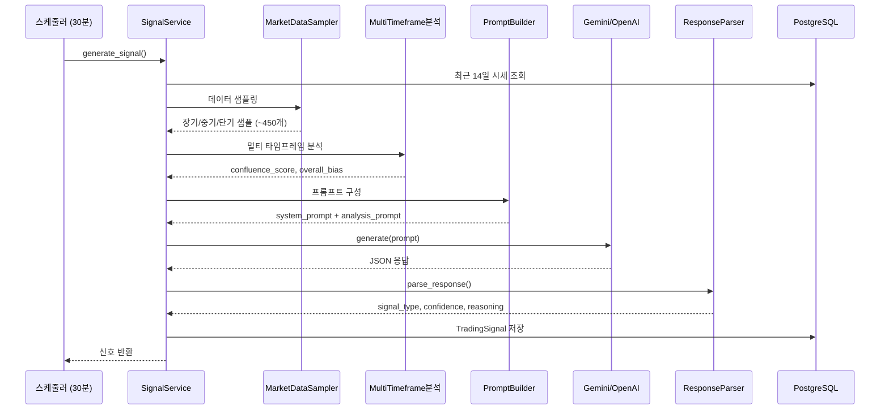
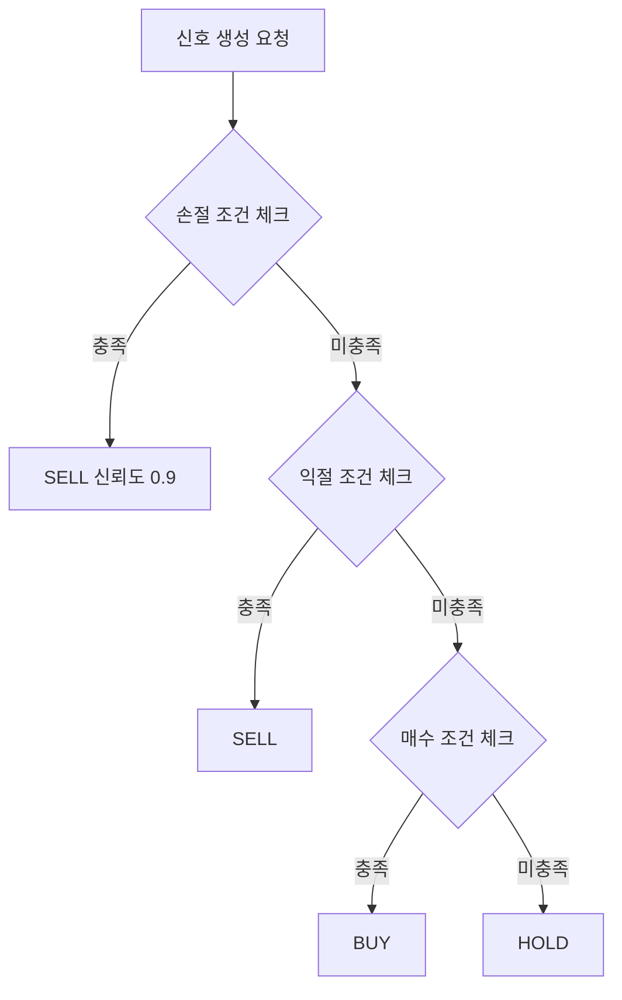

# AI 신호 생성 시스템 분석

> 최종 업데이트: 2026-01-24
> 대상: Bitcoin-Auto-Trading Backend
> 브랜치: 001-signal-prompt-optimization

---

## 1. 시스템 개요

### 1.1 핵심 구성요소

```
signal/
├── service.py              # 신호 생성 메인 로직
├── prompt/
│   ├── templates.py        # 코인별 시스템 프롬프트 + 신뢰도 공식
│   ├── builder.py          # 분석 프롬프트 구성
│   └── indicator_status.py # 지표 상태 한글화
├── parser/
│   └── response_parser.py  # AI 응답 JSON 파싱
├── sampler/
│   └── market_data_sampler.py  # 시장 데이터 샘플링 (토큰 절감)
├── tracker/
│   └── performance_tracker.py  # 신호 성과 평가 (스케줄러 작업용)
└── classifier/
    └── coin_classifier.py  # 코인 유형 분류
```

### 1.2 신호 생성 흐름



---

## 2. 코인 유형별 프롬프트

### 2.1 코인 분류

| 유형 | 대상 | 특징 |
|------|------|------|
| **메이저** | BTC, ETH, SOL, XRP | 낮은 변동성, 기술적 지표 중시 |
| **밈코인** | DOGE, SHIB, PEPE | 높은 변동성, 거래량/모멘텀 중시 |
| **알트코인** | 기타 | 중간 변동성, 균형 전략 |

### 2.2 손익 설정 비교

| 설정 | 메이저 | 밈코인 | 알트코인 |
|------|:------:|:------:|:--------:|
| 손절 | 1.5% | 3.0% | 2.0% |
| 익절 | 2.5% | 5.0% | 3.5% |
| 트레일링 | 2.0% | 3.5% | 2.5% |
| 본전손절 | 1.0% | 2.0% | 1.5% |
| RSI 과매수 | 70 | 80 | 75 |
| RSI 과매도 | 30 | 25 | 28 |
| 최소 신뢰도 | 0.60 | 0.55 | 0.60 |
| 최소 합류점수 | 0.45 | 0.50 | 0.55 |

---

## 3. 시장 데이터 샘플링

### 3.1 샘플링 정책

| 시간대 | 범위 | 간격 | 예상 개수 |
|--------|------|------|:--------:|
| 장기 (long_term) | 14일 | 1시간 | ~336개 |
| 중기 (mid_term) | 24시간 | 15분 | ~96개 |
| 단기 (short_term) | 1시간 | 5분 | ~12개 |
| **총계** | - | - | **~450개** |

**효과**: 기존 1,000개 대비 **55% 절감**

### 3.2 샘플링 로직

```python
SAMPLING_CONFIG = {
    "long_term": {"hours": 336, "interval_min": 60},
    "mid_term": {"hours": 24, "interval_min": 15},
    "short_term": {"hours": 1, "interval_min": 5},
}

# 사용 예
sampled_data = self._sampler.get_sampled_data(raw_market_data)
# 결과: {"long_term": [...], "mid_term": [...], "short_term": [...]}
```

---

## 4. 프롬프트 구조

### 4.1 시스템 프롬프트 (코인 유형별)

```
당신은 {currency} 단기 트레이딩 AI입니다. **30분 주기**로 신호를 생성합니다.

## 전략 특성
- 30분 주기 → 빠른 진입/청산 우선, 장기 보유 지양
- 손절/익절: -{stop_loss}% / +{take_profit}%

## 리스크 규칙 (최우선)
**손절 조건** (하나라도 충족 → SELL, 신뢰도 0.9):
- 미실현 손실 >= {stop_loss}%
- 현재가 <= 평균매수가 × (1 - {stop_loss_pct})

## 신호 결정 기준

### SELL (OR 연산)
1. 손절 조건 충족 → 신뢰도 0.9
2. 익절: 이익 >= {take_profit}% AND 하락 신호
3. 모든 TF 하락 AND 이익 > {breakeven}%

### BUY (OR 연산)
1. Confluence >= {min_confluence} AND RSI < {rsi_overbought} AND 2개+ TF 상승
2. 과매도 반등: RSI <= 35 AND BB% <= 25%
3. 횡보장 저점: 모든 TF sideways AND RSI < 40 AND BB% < 30%

### HOLD
- 위 조건 모두 미충족
- 잔고 부족 시
```

### 4.2 분석 프롬프트 구성

```markdown
## {currency}/KRW 분석

**시각**: {timestamp} | **현재가**: {price} KRW | **24H**: {change}%

### 포지션
- KRW 가용 잔고: {krw_available}
- 코인 보유량: {coin_available}
- 평균 매수가: {avg_price}
- 미실현 손익: {pnl} ({pnl_pct}%)

### 리스크 체크
- 손절 기준가: {stop_loss}
- 손절 조건 충족 여부: [YES/NO]

### 기술적 지표
- RSI (14일): {rsi} ({status})
- MACD: Line/Signal/Hist
- 볼린저밴드: 위치={bb_pct}%
- EMA: 9/21/50일
- ATR: 변동성 수준

### MTF 분석
- 1H/4H/1D/1W 추세
- 합류 점수: {confluence}/1.00
- 종합 편향: {bias}

### 결정 로직
1. 손절: 손실 >= {stop_loss}% → SELL(0.9)
2. 익절: 이익 >= {take_profit}% + 하락 → SELL
3. 매수: Confluence + RSI + TF → BUY
4. 반등: RSI/BB 과매도 → BUY
5. 기타: HOLD
```

---

## 5. 기술적 지표

### 5.1 사용 지표

| 지표 | 설정 | 용도 |
|------|------|------|
| RSI | 14일 | 과매수/과매도 판단 |
| MACD | 12-26-9 | 추세 전환 신호 |
| 볼린저밴드 | 20일, 2σ | 가격 위치, 변동성 |
| EMA | 9/21/50일 | 추세 방향, 지지/저항 |
| ATR | 14일 | 변동성 수준 |

### 5.2 멀티 타임프레임

| 타임프레임 | 역할 | 가중치 |
|-----------|------|:------:|
| 1시간봉 | 단기 진입점 | 20% |
| 4시간봉 | 중단기 추세 | 25% |
| 일봉 | 중기 추세 | 30% |
| 주봉 | 장기 추세 | 25% |

**합류 점수 (Confluence Score):**
- 0.0~0.3: 추세 불일치 → HOLD
- 0.3~0.5: 약한 일치 → 소량 매매
- 0.5~0.7: 중간 일치 → 일반 매매
- 0.7~1.0: 강한 일치 → 적극 매매

---

## 6. AI 응답 형식

### 6.1 JSON 구조

```json
{
  "signal": "BUY | HOLD | SELL",
  "confidence": 0.0 ~ 1.0,
  "confidence_breakdown": {
    "base": 0.60,
    "tf_bonus": 0.10,
    "indicator_bonus": 0.05
  },
  "reasoning": {
    "risk_assessment": {
      "stop_loss_triggered": false,
      "unrealized_pnl_pct": -0.5,
      "position_status": "없음 | 수익 | 손실"
    },
    "technical_summary": {
      "confluence_score": 0.68,
      "rsi_14": 38.5,
      "trend_1h": "상승",
      "trend_4h": "상승",
      "trend_1d": "상승",
      "aligned_tf_count": 3
    },
    "decision_rationale": "판단 근거 (1-2문장)"
  }
}
```

### 6.2 신뢰도 계산 공식 (MANDATORY)

```
confidence = base + tf_bonus + indicator_bonus

기본값 (base):
┌─────────────────┬───────┐
│ 조건            │ 값    │
├─────────────────┼───────┤
│ 손절 조건 충족  │ 0.90  │
│ 익절 조건 충족  │ 0.85  │
│ 매수 조건 충족  │ 0.60  │
│ HOLD           │ 0.50  │
└─────────────────┴───────┘

TF 보너스 (같은 방향 타임프레임 수):
┌────────────┬────────┐
│ TF 일치    │ 보너스 │
├────────────┼────────┤
│ 4개 일치   │ +0.15  │
│ 3개 일치   │ +0.10  │
│ 2개 일치   │ +0.05  │
│ 1개 이하   │ +0.00  │
└────────────┴────────┘

지표 보너스:
┌──────────────────────────┬────────┐
│ 조건                      │ 보너스 │
├──────────────────────────┼────────┤
│ RSI 극단 (<=25 or >=75)  │ +0.05  │
│ MACD + BB 신호 일치      │ +0.05  │
└──────────────────────────┴────────┘

최종값 = min(1.0, confidence)
```

---

## 7. 성과 피드백 시스템

### 7.1 개요

- **프롬프트에서 제거됨** (토큰 절감)
- 스케줄러 작업으로만 별도 실행 (`evaluate_signal_performance_job`)
- 대시보드에서 성과 데이터 확인 가능

### 7.2 신호 평가 (24시간 후)

```python
if signal_type == BUY:
    outcome_correct = (price_after_24h > price_at_signal)
elif signal_type == SELL:
    outcome_correct = (price_after_24h < price_at_signal)
else:  # HOLD
    change = abs(price_after_24h - price_at_signal) / price_at_signal
    outcome_correct = (change < 0.03)  # 3% 미만 변동
```

---

## 8. 리스크 관리 연동

### 8.1 프롬프트 단계 (AI 판단)



### 8.2 실행 단계 (OrderValidator)

```
TradingService.execute_from_signal()
  ├─ 1. 거래 활성화 상태 확인
  ├─ 2. 일일 손실 한도 체크 (5%)
  ├─ 3. 변동성 체크 (3%)
  ├─ 4. 포지션 크기 검증 (1-3%)
  └─ 5. 잔고 검증
```

---

## 9. AI 클라이언트

### 9.1 Fallback 전략

```
Gemini 2.5 Pro (Primary)
    ↓ 실패 시
OpenAI GPT-4.1-mini (Fallback)
```

### 9.2 API 설정

| 설정 | 값 |
|------|-----|
| Temperature | 0.3 (낮은 창의성) |
| Max Tokens | 1024 |
| Timeout | 30초 |
| 재시도 | 3회 |
| 재시도 딜레이 | 2초 × 시도횟수 |

### 9.3 비용 추정 (최적화 후)

| 모델 | 입력 ($/1M) | 출력 ($/1M) |
|------|:-----------:|:-----------:|
| Gemini 2.5 Pro | $1.25 | $10.00 |
| GPT-4.1-mini | $0.40 | $1.60 |

**예상 토큰 사용량 (최적화 후):**
- 입력: 3,500-4,000 토큰 (기존 7,500-10,000)
- 출력: 300-500 토큰

**예상 비용 (Gemini 기준):**
- 1회: ~$0.006 (₩8) - 기존 대비 60% 절감
- 일일 (48회): ~$0.29 (₩380) - 기존 24회 ₩480 대비 20% 절감
- 월간: ~$9 (₩11,000)

---

## 10. 주요 상수

```python
# 신호 생성 (최적화 후)
SIGNAL_COOLDOWN_MINUTES = 5       # 수동 생성 쿨다운
SIGNAL_MARKET_DATA_HOURS = 336    # 분석 데이터 범위 (14일)
SIGNAL_DEFAULT_CONFIDENCE = 0.5

# 스케줄러
SIGNAL_GENERATION_INTERVAL = 30   # 30분 주기 (기존 60분)

# 샘플링 설정
SAMPLING_CONFIG = {
    "long_term": {"hours": 336, "interval_min": 60},
    "mid_term": {"hours": 24, "interval_min": 15},
    "short_term": {"hours": 1, "interval_min": 5},
}

# AI
DEFAULT_TIMEOUT = 30
DEFAULT_MAX_RETRIES = 3
```

---

## 11. 최적화 완료 사항 (2026-01-24)

| 항목 | 개선 내용 | 효과 |
|------|----------|------|
| 신호 주기 | 1시간 → 30분 | 빈도 2배 증가 |
| 토큰 사용량 | 10,000 → 4,000 | 60% 절감 |
| 데이터 샘플링 | 1,000개 → 450개 | 55% 절감 |
| 성과 피드백 | 프롬프트에서 제거 | ~500토큰 절감 |
| 신뢰도 계산 | 명시적 공식 적용 | 일관성 향상 |
| 응답 시간 | 5-8초 → 2-4초 | 50% 단축 |

---

## 12. 파일 위치 요약

| 파일 | 역할 |
|------|------|
| `signal/service.py` | 신호 생성 메인 + 샘플링 통합 |
| `signal/prompt/templates.py` | 프롬프트 템플릿 + 신뢰도 공식 |
| `signal/prompt/builder.py` | 프롬프트 조합 (성과 피드백 제거) |
| `signal/sampler/market_data_sampler.py` | 시장 데이터 샘플링 |
| `signal/parser/response_parser.py` | JSON 파싱 |
| `signal/tracker/performance_tracker.py` | 성과 평가 (스케줄러 전용) |
| `signal/classifier/coin_classifier.py` | 코인 분류 |
| `clients/ai/client.py` | AI 통합 클라이언트 |
| `clients/ai/gemini_client.py` | Gemini 구현 |
| `scheduler/jobs/signal_generation.py` | 스케줄러 작업 |
| `config/constants.py` | 샘플링 설정 + 상수 |
