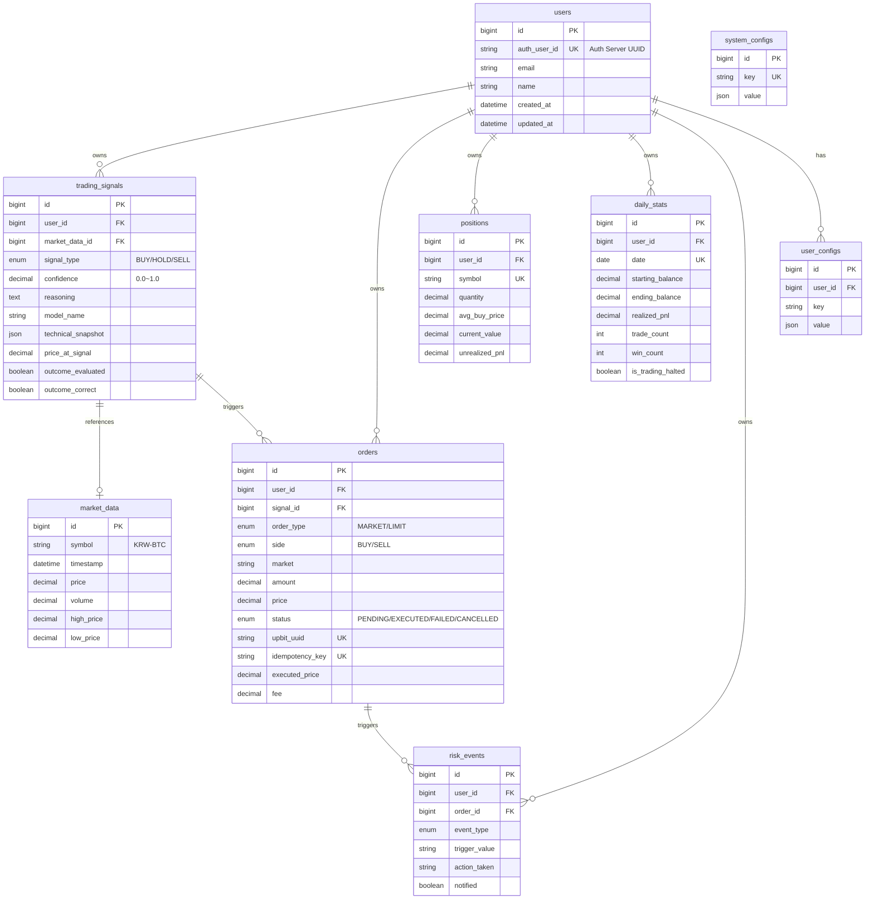

# Bitcoin-Auto-Trading 프로젝트 종합 분석 보고서

> 비트코인 자동 거래 시스템 전면 리팩토링 후 최종 검토
> 작성일: 2026-01-24

---

## 1. 프로젝트 개요

### 1.1 시스템 목적
- **Gemini AI 기반** 비트코인 매매 신호 생성
- **Upbit 거래소** 자동 주문 실행
- **실시간 리스크 관리** 및 손절/변동성 감시

### 1.2 기술 스택
| 구분 | 기술 |
|------|------|
| Backend | Python 3.11+, FastAPI, SQLAlchemy 2.0 (Async) |
| Database | PostgreSQL 15 |
| Scheduler | APScheduler (AsyncIOScheduler) |
| AI | Google Gemini 2.5 Pro, OpenAI GPT-4.1-mini (Fallback) |
| 거래소 | Upbit REST API |

### 1.3 프로젝트 규모
- **102개 Python 파일**
- **~4,900줄 코드**
- **10개 DB 테이블**
- **6개 스케줄러 작업**

---

## 2. 아키텍처 다이어그램

### 2.1 전체 시스템 구조


### 2.2 데이터 흐름 (자동 거래 사이클)


### 2.3 설정 관리 계층


### 2.4 모듈 의존성


### 2.5 DB ERD



---

## 3. 스케줄러 작업 상세

| 작업 ID | 주기 | 기능 | 핵심 로직 |
|---------|------|------|---------|
| `collect_market_data` | 10초 | 시세 수집 | Upbit → MarketData 저장 |
| `generate_trading_signal` | 1시간 | AI 신호 생성 + 자동 매매 | 지표 분석 → Gemini → BUY/SELL 시 주문 |
| `check_volatility` | 30초 | 변동성 감시 | 5분 변동률 > 3% 시 거래 중단 |
| `evaluate_signal_performance` | 4시간 | 신호 성과 평가 | 24시간 후 가격 비교 |
| `sync_pending_orders` | 5분 | PENDING 주문 동기화 | Upbit 상태 확인 → DB 업데이트 |
| `cleanup_old_data` | 24시간 | 오래된 데이터 삭제 | 365일 이상 MarketData 삭제 |

---

## 4. 리스크 관리 체계

### 4.1 체크 시점 및 순서


### 4.2 기본 설정값

| 설정 | 기본값 | 설명 |
|------|--------|------|
| position_size_min_pct | 1% | 최소 포지션 (신뢰도 0.5) |
| position_size_max_pct | 3% | 최대 포지션 (신뢰도 0.9+) |
| stop_loss_pct | 5% | 개별 손절 |
| daily_loss_limit_pct | 5% | 일일 손실 한도 |
| volatility_threshold_pct | 3% | 5분 변동성 임계값 |

---

## 5. 디렉토리 구조

```
backend/src/
├── app.py                      # FastAPI 진입점
├── config/
│   ├── settings.py             # Pydantic BaseSettings
│   ├── constants.py            # 불변 상수
│   └── logging.py              # loguru 설정
│
├── entities/                   # SQLAlchemy ORM (10개)
│   ├── base.py                 # Base, Mixins
│   ├── user.py
│   ├── market_data.py
│   ├── trading_signal.py
│   ├── order.py
│   ├── position.py
│   ├── daily_stats.py
│   ├── risk_event.py
│   ├── system_config.py
│   └── user_config.py
│
├── repositories/               # DB 접근 계층 (8개)
│   ├── base.py                 # Generic CRUD
│   ├── market_repository.py
│   ├── signal_repository.py
│   ├── order_repository.py
│   ├── position_repository.py
│   ├── config_repository.py
│   ├── user_repository.py
│   └── user_config_repository.py
│
├── modules/                    # 도메인별 모듈
│   ├── market/
│   │   ├── collector/          # DataCollector (싱글톤)
│   │   ├── analysis/           # TechnicalIndicatorCalculator
│   │   ├── routes.py
│   │   ├── service.py
│   │   └── schemas.py
│   │
│   ├── signal/
│   │   ├── prompt/             # SignalPromptBuilder
│   │   ├── parser/             # SignalResponseParser
│   │   ├── classifier/         # CoinClassifier
│   │   ├── tracker/            # SignalPerformanceTracker
│   │   ├── routes.py
│   │   ├── service.py
│   │   └── schemas.py
│   │
│   ├── trading/
│   │   ├── position/           # PositionManager
│   │   ├── monitor/            # OrderMonitor
│   │   ├── validator/          # OrderValidator
│   │   ├── routes.py
│   │   ├── service.py
│   │   └── schemas.py
│   │
│   ├── risk/
│   │   ├── routes.py
│   │   ├── service.py
│   │   └── schemas.py
│   │
│   ├── config/                 # 설정 API
│   ├── dashboard/              # 대시보드
│   ├── health/                 # 헬스체크
│   ├── auth/                   # 인증
│   └── notification/           # 알림
│
├── clients/                    # 외부 API
│   ├── upbit/
│   │   ├── public_api.py       # 시세 조회
│   │   ├── private_api.py      # 주문/잔고
│   │   └── common.py           # 데이터 모델
│   ├── ai/
│   │   ├── client.py           # AIClient (Fallback)
│   │   ├── gemini_client.py
│   │   ├── openai_client.py
│   │   └── base.py             # BaseAIClient
│   ├── slack_client.py
│   └── auth_client.py
│
├── scheduler/
│   ├── scheduler.py            # APScheduler 설정
│   └── jobs/                   # 6개 작업
│       ├── data_collection.py
│       ├── signal_generation.py
│       ├── check_volatility.py
│       ├── evaluate_signal_performance.py
│       ├── order_sync.py
│       └── cleanup.py
│
├── api/
│   └── router.py               # 라우터 통합
│
└── utils/
    ├── database.py             # 세션 관리
    ├── decorators.py
    └── exceptions.py
```

---

## 6. API 엔드포인트

| 모듈 | 메서드 | 경로 | 설명 |
|------|--------|------|------|
| Health | GET | `/health` | 서버 상태 |
| Market | GET | `/market` | 현재 시세 |
| | GET | `/market/history` | 과거 시세 |
| | GET | `/market/summary` | 통계 요약 |
| Dashboard | GET | `/dashboard/summary` | 종합 대시보드 |
| Signals | GET | `/signals` | 신호 내역 |
| | GET | `/signals/latest` | 최신 신호 |
| | POST | `/signals/generate` | 수동 신호 생성 |
| Trading | GET | `/trading/orders` | 주문 내역 |
| | GET | `/trading/position` | 현재 포지션 |
| | GET | `/trading/balance` | 계좌 잔고 |
| | POST | `/trading/orders/sync` | 주문 동기화 |
| Risk | GET | `/risk/events` | 리스크 이벤트 |
| | GET | `/risk/status` | 리스크 상태 |
| | POST | `/risk/halt` | 거래 중단 |
| | POST | `/risk/resume` | 거래 재개 |
| Config | GET | `/config` | 전체 설정 |
| | GET | `/config/{key}` | 단일 설정 |
| | PATCH | `/config/{key}` | 설정 수정 |

---

## 7. 코드 품질 평가

### 7.1 강점

| 항목 | 평가 |
|------|------|
| **아키텍처** | 계층화 잘 됨 (Entity → Repository → Service → Route) |
| **비동기 처리** | 전면 async/await, SQLAlchemy 2.0 async |
| **설정 관리** | 3계층 분리 (환경변수/DB/상수) |
| **리스크 관리** | 4단계 체크, 이벤트 기록 |
| **싱글톤 패턴** | 클라이언트/서비스 재사용 |
| **다중 사용자** | UserOwnedMixin으로 데이터 격리 |
| **AI Fallback** | Gemini 실패 시 OpenAI 자동 전환 |

### 7.2 개선 필요 사항

| 항목 | 현재 상태 | 권장 사항 |
|------|---------|---------|
| 수동 주문 API | 미구현 | `POST /trading/orders` 엔드포인트 추가 |
| 거래 자동 재개 | 없음 | 변동성 정상화 시 자동 재개 옵션 |
| 단위 테스트 | 부재 | pytest 테스트 추가 필요 |
| API 문서화 | 기본 | Swagger 설명 강화 |

---

## 8. 프론트엔드 개발 시 참고사항

### 8.1 필수 API 호출

```typescript
// 대시보드 메인
GET /api/v1/dashboard/summary
→ 현재가, 포지션, 잔고, 손익 한번에 조회

// 설정 관리
GET /api/v1/config
PATCH /api/v1/config/{key}

// 거래 내역
GET /api/v1/trading/orders?limit=50
GET /api/v1/signals?limit=20

// 리스크 제어
GET /api/v1/risk/status
POST /api/v1/risk/halt
POST /api/v1/risk/resume
```

### 8.2 WebSocket 미지원
- 현재 REST API만 제공
- 실시간 시세는 **폴링** 필요 (10초 권장)

### 8.3 인증 흐름
- Auth Server에서 JWT 발급
- `Authorization: Bearer {token}` 헤더로 전달
- 백엔드에서 토큰 검증

---

## 9. 운영 명령어

```bash
# 서비스 관리
sudo systemctl restart bitcoin-backend
sudo systemctl status bitcoin-backend
journalctl -u bitcoin-backend -f

# 개발 서버
make dev-backend
make test-backend
make lint-fix

# DB 마이그레이션
make db-migrate
```

---

## 10. 결론

리팩토링 후 프로젝트는 **엔터프라이즈급 아키텍처**를 갖추었으며:

1. **명확한 계층 분리**: Entity → Repository → Service → Route
2. **유연한 설정 관리**: 환경변수 + DB + 불변상수 3계층
3. **견고한 리스크 관리**: 4단계 검증 + 이벤트 로깅
4. **확장 가능한 구조**: 모듈별 독립성, 싱글톤 패턴

프론트엔드 개발 시 위 API 명세와 데이터 흐름을 참고하여 구현하면 됩니다.
