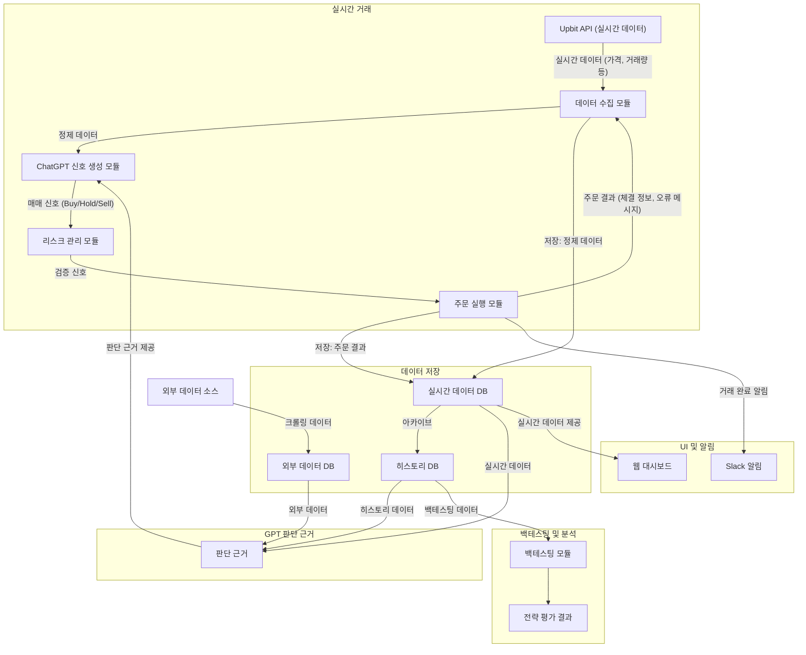
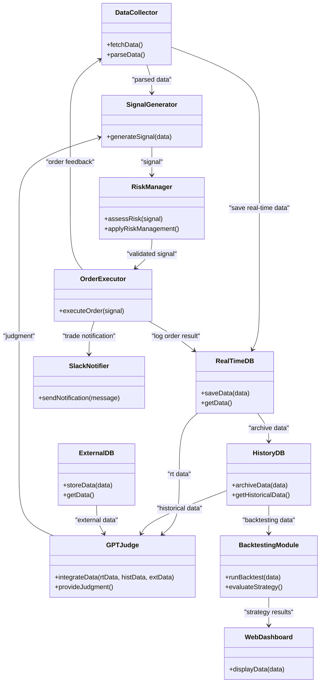

### 데이터 흐름도

### 설명

- **실시간 거래 영역:**  
  Upbit API에서 실시간 데이터를 수신하여, 데이터 수집 모듈이 정제한 후 ChatGPT 신호 생성 모듈로 전달합니다. 리스크 관리 모듈을 거쳐 주문 실행 모듈이 실제 거래를 실행하며, 주문 결과는 다시 데이터 수집 모듈에 피드백됩니다.

- **데이터 저장 영역:**  
  실시간 데이터와 주문 결과는 실시간 데이터 DB(RT)에 저장되며, 이후 아카이브되어 히스토리 DB(HIST)로 전송됩니다. 외부 데이터 소스(X)에서 크롤링한 데이터는 외부 데이터 DB(EXT)에 저장됩니다.

- **GPT 판단 근거 영역:**  
  RT, HIST, EXT에 저장된 데이터가 GPT 판단 근거로 통합되어, 이를 바탕으로 ChatGPT 신호 생성 모듈에서 보다 풍부한 매매 신호를 도출할 수 있게 됩니다.

- **백테스팅 및 분석 영역:**  
  히스토리 DB의 데이터를 활용하여 백테스팅 모듈이 시뮬레이션을 수행하고, 전략 평가 결과를 산출합니다.

- **UI 및 알림 영역:**  
  실시간 데이터 DB의 데이터는 웹 대시보드(WD)를 통해 모니터링되며, 주문 실행 결과에 따라 거래 완료 알림이 Slack(SL)으로 전송됩니다.

### 클래스 다이어그램

### 설명

- **실시간 거래 관련 모듈:**  
  - **DataCollector:** Upbit API에서 데이터를 받아와 정제하는 역할  
  - **SignalGenerator:** 정제된 데이터를 기반으로 매매 신호를 생성  
  - **RiskManager:** 생성된 신호에 대해 리스크 평가 및 관리를 수행  
  - **OrderExecutor:** 최종 신호를 바탕으로 주문을 실행하며, 주문 결과를 DataCollector에 피드백

- **데이터 저장:**  
  - **RealTimeDB:** 실시간 데이터 및 주문 결과를 저장 (빠른 조회 목적)  
  - **HistoryDB:** RealTimeDB의 데이터를 아카이브하여 백테스팅용으로 활용  
  - **ExternalDB:** 외부 크롤링 데이터 등 추가 데이터를 저장

- **GPT 판단 근거:**  
  - **GPTJudge:** 실시간, 히스토리, 외부 데이터를 통합하여, ChatGPT 기반의 추가 판단 근거를 제공하며, 이를 SignalGenerator에 전달하여 매매 신호 개선에 기여

- **백테스팅 및 UI/알림:**  
  - **BacktestingModule:** 히스토리 데이터를 활용해 전략을 시뮬레이션 및 평가  
  - **WebDashboard:** 백테스팅 결과와 실시간 데이터를 모니터링하기 위해 UI를 제공  
  - **SlackNotifier:** 주문 완료 등 주요 이벤트 발생 시 Slack 알림 전송

