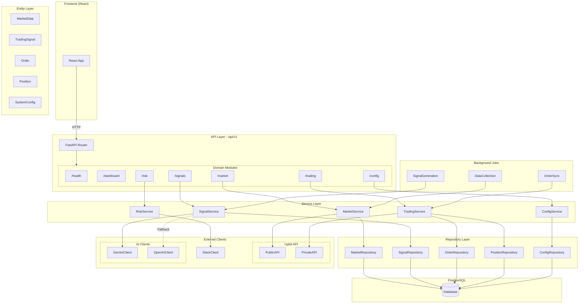

# Backend Architecture

> 리팩토링 완료: 2026-01-24 | Branch: `2-backend-layered-arch`

## 전체 아키텍처



---

## 데이터 흐름

```mermaid
flowchart LR
    A[Upbit API] -->|시세 수집| B[DataCollector]
    B -->|저장| C[(MarketData)]
    C -->|분석| D[Analyzer]
    D -->|지표 계산| E[Indicators]
    E -->|프롬프트| F[PromptBuilder]
    F -->|AI 호출| G[Gemini/OpenAI]
    G -->|파싱| H[ResponseParser]
    H -->|저장| I[(TradingSignal)]
    I -->|검증| J[OrderValidator]
    J -->|실행| K[Upbit Private API]
    K -->|결과| L[(Order)]
```



---

## 디렉토리 구조

```
backend/src/
├── main.py                 # FastAPI 앱 진입점
├── app.py                  # FastAPI 앱 설정
├── database.py             # SQLAlchemy 엔진/세션
│
├── config/                 # 설정 중앙화
│   ├── settings.py         # Pydantic BaseSettings
│   ├── constants.py        # 불변 상수
│   └── logging.py          # 로깅 설정
│
├── entities/               # SQLAlchemy ORM 모델
│   ├── base.py             # Base, TimestampMixin
│   ├── market_data.py      # 시세 데이터
│   ├── trading_signal.py   # AI 매매 신호
│   ├── order.py            # 주문
│   ├── position.py         # 포지션
│   ├── daily_stats.py      # 일일 통계
│   ├── risk_event.py       # 리스크 이벤트
│   └── system_config.py    # 시스템 설정
│
├── repositories/           # DB 접근 계층
│   ├── base.py             # BaseRepository (Generic CRUD)
│   ├── market_repository.py
│   ├── signal_repository.py
│   ├── order_repository.py
│   ├── position_repository.py
│   └── config_repository.py
│
├── modules/                # 도메인별 모듈
│   ├── market/             # 시세 (수집, 분석, 지표)
│   │   ├── routes.py
│   │   ├── service.py
│   │   ├── schemas.py
│   │   ├── data_collector.py
│   │   ├── analyzer.py
│   │   └── indicators.py
│   │
│   ├── signal/             # AI 신호 (생성, 파싱, 프롬프트)
│   │   ├── routes.py
│   │   ├── service.py
│   │   ├── schemas.py
│   │   ├── prompt_builder.py
│   │   ├── response_parser.py
│   │   └── performance_tracker.py
│   │
│   ├── trading/            # 거래 (주문, 포지션, 검증)
│   │   ├── routes.py
│   │   ├── service.py
│   │   ├── schemas.py
│   │   ├── order_validator.py
│   │   ├── order_monitor.py
│   │   └── position_manager.py
│   │
│   ├── risk/               # 리스크 (체크, 이벤트)
│   │   ├── routes.py
│   │   ├── service.py
│   │   ├── schemas.py
│   │   └── event_manager.py
│   │
│   ├── config/             # 설정 API
│   ├── dashboard/          # 대시보드
│   └── health/             # 헬스체크
│
├── clients/                # 외부 API 클라이언트
│   ├── upbit/              # Upbit (public_api, private_api)
│   ├── ai/                 # AI (gemini, openai, base)
│   ├── slack_client.py     # Slack 알림
│   └── auth_client.py      # 인증 서버
│
├── scheduler/              # 스케줄러
│   ├── scheduler.py
│   └── jobs/               # 백그라운드 작업
│       ├── data_collection.py
│       ├── signal_generation.py
│       ├── order_sync.py
│       └── cleanup.py
│
└── api/                    # API 라우터 통합
    └── router.py           # /api/v1 라우터
```

---

## 계층별 책임

| 계층 | 책임 | 예시 |
|------|------|------|
| **API (routes.py)** | HTTP 요청/응답, 인증 | `@router.get("/market")` |
| **Service** | 비즈니스 로직, 트랜잭션 | `SignalService.generate()` |
| **Repository** | DB CRUD 추상화 | `OrderRepository.get_pending()` |
| **Entity** | ORM 모델 정의 | `class Order(Base)` |
| **Client** | 외부 API 통신 | `GeminiClient.generate()` |

---

## DB 오버라이드 가능 설정 (7개)

프론트엔드 Settings 페이지에서 수정 가능:

| 설정 | 설명 | 기본값 |
|------|------|--------|
| `position_size_min_pct` | 최소 포지션 크기 | 25% |
| `position_size_max_pct` | 최대 포지션 크기 | 50% |
| `stop_loss_pct` | 시스템 손절매 | 5% |
| `daily_loss_limit_pct` | 일일 손실 한도 | 5% |
| `signal_interval_hours` | AI 신호 주기 | 1시간 |
| `volatility_threshold_pct` | 변동성 임계값 | 3% |
| `ai_model` | AI 모델 | gemini-2.5-pro |

**환경변수 전용:**
- `trading_ticker`: 거래 대상 (배포 레벨 변경)
- `trading_enabled`: Risk API (`/halt`, `/resume`)로 제어

---

## API 엔드포인트

| 메서드 | 경로 | 설명 |
|--------|------|------|
| GET | `/health` | 서버 상태 |
| GET | `/dashboard/summary` | 대시보드 요약 |
| GET | `/market` | 현재 시세 |
| GET | `/market/history` | 과거 시세 |
| GET | `/signals` | AI 신호 내역 |
| POST | `/signals/generate` | AI 신호 수동 생성 |
| GET | `/trading/orders` | 주문 내역 |
| GET | `/trading/position` | 현재 포지션 |
| GET | `/trading/balance` | 계좌 잔고 |
| GET | `/risk/status` | 리스크 상태 |
| POST | `/risk/halt` | 거래 중단 |
| POST | `/risk/resume` | 거래 재개 |
| GET | `/config` | 설정 조회 |
| PATCH | `/config` | 설정 수정 |
