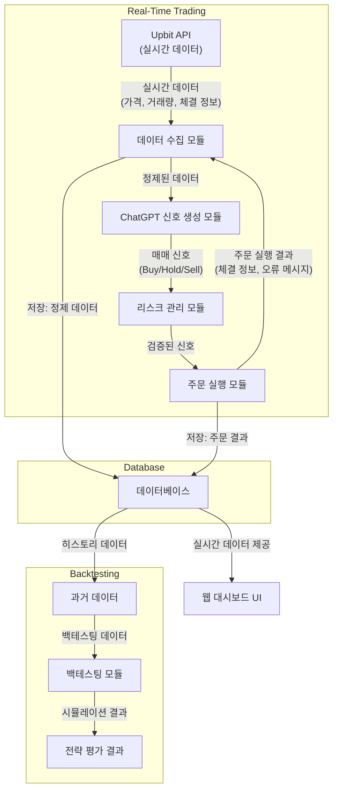

### 데이터 흐름도

### 설명

- **실시간 거래 흐름:**
    1. **Upbit API**에서 실시간으로 가격, 거래량 등 원시 데이터를 수신합니다.
    2. **데이터 수집 모듈**이 데이터를 정제하여 AI가 활용할 수 있는 형태로 변환합니다.
    3. **ChatGPT 신호 생성 모듈**은 정제된 데이터를 바탕으로 매매 신호(Buy, Hold, Sell)를 도출합니다.
    4. **리스크 관리 모듈**에서 해당 신호에 대해 포지션 사이징, 손절 조건 등을 적용하여 검증합니다.
    5. **주문 실행 모듈**은 최종 신호에 따라 Upbit API를 통해 주문을 실행하고, 그 결과를 피드백합니다.
- **DB 저장:**
    - **정제 데이터:** 데이터 수집 모듈에서 처리된 정제 데이터를 데이터베이스에 저장합니다.
    - **주문 결과:** 주문 실행 결과(체결 정보, 오류 메시지 등)도 데이터베이스에 저장하여, 후속 백테스팅 및 전략 개선에 활용합니다.
- **백테스팅 흐름:**
    - 데이터베이스에 저장된 히스토리 데이터를 기반으로 **백테스팅 모듈**이 시뮬레이션을 진행하고, 그 결과를 평가합니다.